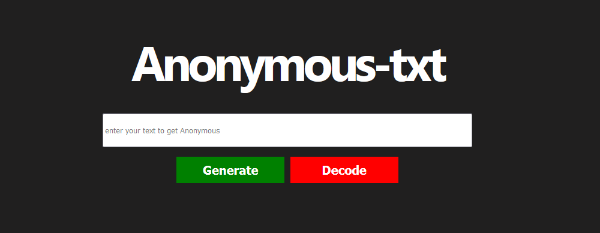

# Anonymous-text
Anonymous-text is a created random generator of letters from your following text. It has a decode function that allows you to change an anonymous text to original text.



sample example:
```
.col {
background:url("img/mountain.jpg?=UmVhZHkgdG8gdGFrZSB5b3VyIGlkZWEgdG8gdGhlIG5leHQgbGV2ZWwg5zLg");
}
```

# Tools Used
Javascript

# Copyright & License
© 2021 Suresh Pandiyan 
Code released under MIT License
